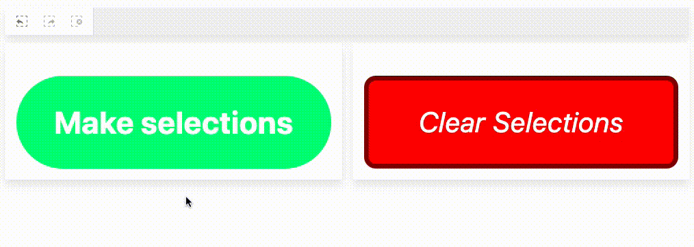

> **Warning** This repository is now archived and will not be updated

> This repository was originally published to foster collaboration and engagement with developers as they customized or developed visualizations, but due to customer feedback and usage data, it is now moved back to closed source. Moving this and other projects back to closed source will support better integration with internal build and test tooling, and free up resources for investment in these and other visualizations.

# sn-action-button

[](https://codeclimate.com/github/qlik-oss/sn-action-button/maintainability)
[](https://codeclimate.com/github/qlik-oss/sn-action-button/test_coverage)

Action button supernova for nebula.js



## Installing

If you use npm: `npm install @nebula.js/sn-action-button`. You can also load through the script tag directly from [https://unpkg.com](https://unpkg.com/@nebula.js/sn-action-button).

## Usage

```js
import { embed } from '@nebula.js/stardust';
import actionButton from '@nebula.js/sn-action-button';

// 'app' is an enigma app model
const nuked = embed(app, {
  types: [{ // register the action button object
    name: 'action-button',
    load: () => Promise.resolve(actionButton);
  }]
});

nuked.render({
  element,
  type: 'action-button',
});
```

[See full example](./example)
